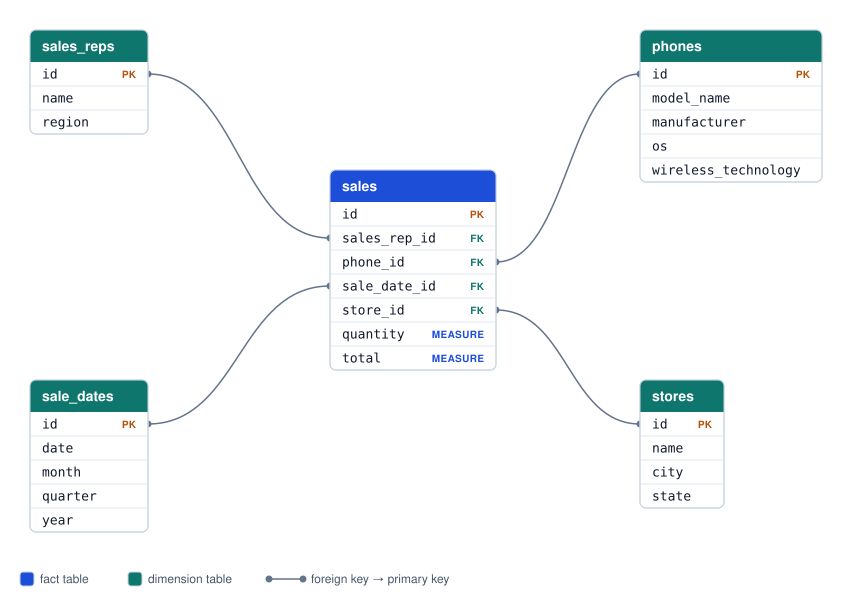
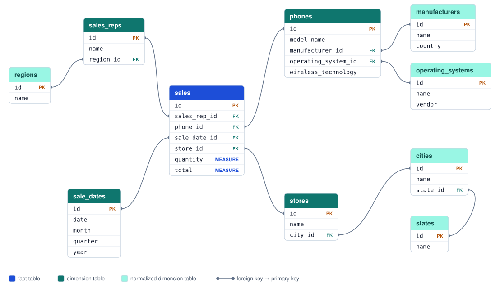

# ActiveReporting

ActiveReporting implements various terminology used in Relational Online Analytical Processing (Commonly referred to as ROLAP) with ActiveRecord. It provides a DSL to describe reports and analytics on your data.

ActiveReporting officially supports MySQL, PostgreSQL, and SQLite.

ActiveReporting officially supports [Ruby versions under official support](https://endoflife.date/ruby).

ActiveReporting officially supports [Rails versions under official support](https://endoflife.date/rails).

## Installation

Add this line to your application's Gemfile:

```ruby
gem 'active_reporting'
```

And then execute:

    $ bundle

Or install it yourself as:

    $ gem install active_reporting

## What is "Reporting"?

Reporting is the collection and presentation of data so that it can be analyzed. Our databases only store one thing: data. Data is great for computers but mostly worthless to humans. What ActiveReporting does is turn that _data_ into _information_ to help humans make decisions.

## Terminology

ROLAP uses a set of terms to describe how a report is generated. ActiveReporting implements them in the closest way possible in Ruby-land.

### Fact table (sometimes called fact model)

A fact table is the primary table where information is derived from in a report. It commonly contains fact columns (usually numeric values) and dimension columns (foreign keys to other tables or values that can be grouped together).

SQL Equivalent: FROM

Rails: ActiveRecord model

### Dimension

A dimension is a point of data used to "slice and dice" data from a fact model. It's either a column that lives on the fact table or a foreign key to another table.

Examples:

- A sales rep on a fact table of sales
- A state of a sale on a state machine
- The manufacturer on a fact table of widgets

SQL Equivalent: JOIN, GROUP BY

Rails: ActiveRecord relation or attribute

### Dimension Hierarchy

A hierarchy for a dimension is related attributes that live on a dimension table used to drill down and drill up through a dimension.

Examples:

- Dates: Date, Month, Year, Quarter
- Mobile Phone: Model, Manufacturer, OS, Wireless Technology

### Dimension Member (also known as dimension labels)

This is information related to a dimension. When the dimension lives on the fact table, the label is the column used. When the dimension is a related table, the label is a column representing the hierarchy level.

Examples:

- When dimensioning blog posts by category, the dimension is the category_id which leads to the categories table. The label would be the category name.

### Dimension Filter (or just "filter")

This isn't really an official term, but I like using it to describe further filtering of dimensionable data.

SQL Equivalent: WHERE

Rails: `where()`, scopes, etc.

### Measure

A measure is a column in a fact table (usually a numeric value) used in aggregations such as sum, maximum, average, etc.

Examples:

- Total amount in a sale
- Number of units used in a transaction

SQL Equivalent: Column in the fact table used in an aggregation function

Rails: ActiveRecord attribute

### Metric

A metric is a measured value and the subject of the report. It is the result of _the_ question you want answered.

SQL Equivalent: A query result

Rails: The result of an ActiveRecord query

### Star Schema

Star schema is a way of structuring your relational data. It is one of the most common forms of organization for relational data warehousing. The layout of a star schema consists of a fact table referencing one or more dimension tables. When laid out in an entity relationship diagram, it resembles a star.



More information: https://en.wikipedia.org/wiki/Star_schema

### Snowflake Schema

Snowflake schema is a super class of star schema. A fact table still resides in the middle of the diagram, but dimension tables are normalized out into multiple tables resulting in the resemblance of a snowflake.



More information: https://en.wikipedia.org/wiki/Snowflake_schema

ActiveReporting is built with star schema in mind, but will work with snowflake.

## Configuration

Configure ActiveReporting via block configuration or by setting individual settings:

```ruby
ActiveReporting::Configuration.config do |c|
  c.setting = value
end
```

```ruby
ActiveReporting::Configuration.setting = value
```

### Configuration Options

`default_dimension_label` - If a fact model does not have a default label set for when it's used as a dimension, this value will be used. (Default: `:name`)

`default_measure` - If a fact model does not specify a measure to use for aggregates, this value will be used. (Default: `:value`)

`ransack_fallback` - If the ransack gem is available, allow all unknown dimension filters to be delegated to ransack. (Default: `false`)

`metric_lookup_class` - The name of a constant used to lookup prebuilt `ActiveReporting::Metric` objects by name. The constant should define a class method called `#lookup` which can take a string or symbol of the metric name. Accepts a class, string, or symbol; the name is used as-is (`:stored_metrics` becomes `::StoredMetrics`). (Default: `::Metric`)

## ActiveReporting::FactModel

In ActiveReporting, a fact model stores configuration information on how it can be used in reports. We use the term fact model instead of fact table because this class "models how the fact table interacts with dimensions and other reporting features".

You can put these classes anywhere you want in your app, though I recommend putting them in `app/fact_models` so Rails autoloads and reloads them with your models

### Linking a fact model to an ActiveRecord model

Every fact model links to an ActiveRecord model. This is done either by naming convention or by explicitly declaring the model.

This naming convention is `[ModelName]FactModel`. Meaning if you have an ActiveRecord model named `Ticket`, you'll then have a `TicketFactModel` to link them together.

```ruby
class TicketFactModel < ActiveReporting::FactModel

end
```

Alternatively, you may manually specify the model with `self.model=`

```ruby
class TicketFactModel < ActiveReporting::FactModel
  self.model= SomeOtherModel
  # OR you may pass in a string or symbol
  # self.model= :some_other_model
  # self.model= 'some_other_model'
  # self.model= 'SomeOtherModel'
end
```

If a model doesn't have a fact model, ActiveReporting generates one with the default configuration the first time it's needed (for example, when the model is used as a dimension). Generated fact models aren't assigned to a constant, so define a `[ModelName]FactModel` class if you need to refer to one.

In Rails, fact models are looked up again after code is reloaded in development, so changes to models and fact models take effect without restarting the server.

### Configuring a fact model's measure

ActiveReporting assumes the column of a fact model used for summing, averaging, etc. is called `value`. This may be changed on a fact model using `measure=`. You may pass in a string or symbol of the column you wish to use for aggregations.

```ruby
class SaleFactModel < ActiveReporting::FactModel
  self.measure = :total
end
```

## Configuring Dimensions

### Declaring dimensions on a fact model

You must declare what a fact model is dimensional by. A valid dimension is a column on the fact model's ActiveRecord model or a `belongs_to`/`has_one through` relationship. `has_many` relationships do not work (well) at all.

```ruby
class TicketFactModel < ActiveReporting::FactModel
  dimension :creator # belongs_to relationship
  dimension :assignee # belongs_to relationship
  dimension :category # Column on the tickets table
end
```

### When a fact model is used as a dimension

When another fact model uses a relationship as a dimension, that ActiveRecord model's fact model class can hold configuration information for how to act when used as a dimension.

By default, it is assumed a dimension's label is a column called `name`. This can be changed on the fact model.

```ruby
class UserFactModel < ActiveReporting::FactModel
  default_dimension_label :username
end
```

### Dimension Hierarchies

For dimensions that can have a hierarchy (such as a mobile phone), you can declare what columns make it up. This will allow reports to dimension against a fact model and be able to use different labels to group by.

```ruby
class PhoneFactModel < ActiveReporting::FactModel
  dimension_hierarchy [:model_name, :manufacturer, :os, :wireless_technology]
end
```

### Drill down / Roll up (Drill up) with datetime columns

The fastest approach to group by certain date metrics is to create so-called "date dimensions" and add on columns for each desired hierarchy. For those users that are restricted from organizing their data in this way, ActiveReporting provides a `datetime_drill` option that can be passed with the dimension on the metric definition to drill datetime columns.

To use, declare a datetime dimension on a fact model as normal:

```ruby
class UserFactModel < ActiveReporting::FactModel
  dimension :created_at
end
```

When creating a metric, ActiveReporting will recognize the following datetime hierarchies: (See example under the metric section, below.)

- microseconds
- milliseconds
- second
- minute
- hour
- day
- week
- month
- quarter
- year
- decade
- century
- millennium
- date

A datetime drill truncates the datetime to the given level, like PostgreSQL's [`date_trunc` function](https://www.postgresql.org/docs/current/functions-datetime.html#FUNCTIONS-DATETIME-TRUNC). For example, a `month` drill on `2026-09-15 10:30:00` returns `2026-09-01 00:00:00`, so the same month in different years is grouped separately, and a `week` drill returns the Monday the week starts on. The `date` drill returns the date portion of the datetime.

This works the same on every supported database:

- **PostgreSQL** (including PostGIS) uses `date_trunc` and returns timestamps.
- **MySQL** (both the `mysql2` and `trilogy` adapters) builds the truncated value with [date and time functions](https://dev.mysql.com/doc/refman/8.4/en/date-and-time-functions.html) and returns `DATETIME` values.
- **SQLite** emulates `date_trunc` and returns the truncated datetime as `YYYY-MM-DD HH:MM:SS` text.

## Configuring Dimension Filters

A dimension filter provides filtering for a report. In SQL-land, this is the `WHERE` clause.

Available dimension filters are defined on a `FactModel`. They can be implemented via a similar syntax to a Rails scope, link to the fact model's ActiveRecord model's scope, or delegate to ransack.

```ruby
class TicketFactModel < ActiveReporting::FactModel
  dimension_filter :open
  dimension_filter :for_category_name, ->(x) { joins(:category).where(categories: {name: x}) }
  dimension_filter :subject_cont, :ransack
end
```

The first example exposes the `Ticket.open` scope to the fact model allowing it to be used as a dimension filter.

The second example defines a lambda to be invoked like a Rails scope. It joins against the `category` relationship on `Ticket` and filters by the category's name.

The third example defines a filter called "subject_cont" and will delegate it to ransack when called. Ransack is loaded the first time it's needed; add it to your Gemfile to use it. Ransack 4 and newer also require the model to allowlist searchable attributes with a `ransackable_attributes` class method (here, `Ticket.ransackable_attributes` must include `subject`).

Only dimension filters defined in the fact model may be used. Whitelisting available filters allows for more control over what the user may filter by. Giving the user full control to call any scope or method from the ActiveRecord model could lead to unexpected results, poor performing queries, or possible security concerns.

If ransack is available, you may flag a fact model to delegate all unknown dimension filters to ransack.

```ruby
class TicketFactModel < ActiveReporting::FactModel
  use_ransack_for_unknown_dimension_filters
end
```

## ActiveReporting::Metric

A `Metric` is the basic building block used to describe a question you want to answer. At minimum, a metric needs a name, a fact table and an aggregate. You can expand a metric further by including dimensions and dimension filters.

```ruby
my_metric = ActiveReporting::Metric.new(
  :sale_total,
  fact_model: SaleFactModel,
  aggregate: :sum
)
```

`name` - This is the identifying name of the metric.

`fact_model` - An `ActiveReporting::FactModel` class

`aggregate` - The SQL aggregate used to calculate the metric. Supported aggregates include count, max, min, avg, and sum. (Default: `:count`)

`dimensions` - An array of dimensions used for the metric. When given just a symbol, the default dimension label will be used for the dimension.

You may pass a hash instead of a symbol to customize the dimension options (example: { dimension_name: { option1: value, option2: value}}). The available options are:

- `field` - Specify the hierarchy level that should be used instead of the default dimension label. Ex: `[:sales_rep, {mobile_phone: { field: :manufacturer }}]`. If you use a hash instead of a Symbol to define a hierarchy the `field` item must be a valid field in your table.

- `name` - You may customize the label alias, by default the dimension name will be used. The `name` can be whatever label you want. Ex: `[{sale_date: { field: :month, name: :a_custom_name_for_month }}]`.

- `join_method` - You may choose the join_method with the dimension. The default value for join_method is :joins which does a standard "INNER JOIN", but you can pass a :left_outer_joins to use "LEFT OUTER JOIN" instead. Ex: `[{sales_rep: { join_method: :left_outer_joins }}]`

- `datetime_drill` - To drill up and down over datetime column you may pass a `datetime_drill`. Ex: `[:sales_rep, { order: { field: :created_at, datetime_drill: :month }}]`. This option will perform an implicit drill over datetime columns and not a date dimension relationship.

`dimension_filter` - A hash where the keys are dimension filter names and the values are the values passed into the filter.

`metric_filter` - An additional HAVING clause to be tacked on to the end of the query. This allows for the further filtering of the end results based on the value of the aggregate. (Examples: `{gt: 3}`, `{eq: 5}`, `{lte: 7}`)

`measure` - Override the measure on the `ActiveReporting::FactModel` used.

`order_by_dimension` - Allows you to set the ordering of the results based on a dimension label. (Examples: `{author: :desc}`, `{sales_rep: :asc}`)

You can take advantage of datetime drills on `datetime` columns, as mentioned above:

```ruby
class UserFactModel < ActiveReporting::FactModel
  dimension :created_at
end

my_metric = ActiveReporting::Metric.new(
  :my_total,
  fact_model: UserFactModel,
  dimensions: [{ created_at: { datetime_drill: :quarter }} ]
)
```

## ActiveReporting::Report

A `Report` takes an `ActiveReporting::Metric` and ties everything together. It is responsible for building and executing the query to generate a result. The result is a simple array of hashes.

```ruby
metric = ActiveReporting::Metric.new(
  :sale_count,
  fact_model: SaleFactModel,
  dimensions: [:sales_rep],
  dimension_filter: {months_ago: 1}
)

report = ActiveReporting::Report.new(metric)
report.run
=> [{sale_count: 12, sales_rep: 'Fred Jones', sales_rep_identifier: 123},{sale_count: 17, sales_rep: 'Mary Sue', sales_rep_identifier: 123}]
```

A `Report` may also take additional arguments to merge with the `Metric`'s information. This can be user input for additional filters, or to expand on a base `Metric`.

`dimension_identifiers` - When true, the result will include the database identifier columns of the dimensions. For example, when running a report for the total number of sales dimensioned by sales rep, the rep's IDs from the `sales_reps` table will be included. (Default `true`)

`dimension_filter` - A hash that will be merged with the `Metric`'s dimension filters.

`dimensions` - An array of additional dimensions which are merged with the `Metric`'s dimensions.

`metric_filter` - Sets the HAVING clause of the final query and is merged with the `Metric`'s metric filter.

```ruby
metric = ActiveReporting::Metric.new(
  :sale_count,
  fact_model: SaleFactModel,
  dimensions: [:sales_rep],
  dimension_filter: {months_ago: 1}
)

report = ActiveReporting::Report.new(metric, dimension_filter: {from_region: 'North'}, dimension_identifiers: false)
report.run
=> [{sale_count: 17, sales_rep: 'Mary Sue'}]
```

It may be more DRY to store ready-made metrics in a database table or stored in memory to use as the basis for various reports. You can pass a string or symbol into a `Report` instead of a `Metric` to look up a pre-made metric. This is done by passing the symbol or string into the `lookup` class method on the constant defined in `ActiveReporting::Configuration.metric_lookup_class`.

```ruby
class StoredMetrics
  def lookup(metric_name)
    # Code to construct and return an `ActiveReporting::Metric` object
  end
end

ActiveReporting::Configuration.metric_lookup_class = StoredMetrics

report = ActiveReporting::Report.new(:a_stored_metric, ...)
```

## Development

After checking out the repo, run `bin/setup` to install dependencies, then `bundle exec rake test` to run the tests. You can also run `bin/console` for an interactive prompt that will allow you to experiment.

Before opening a pull request, run `bundle exec rubocop` and, if you have [codespell](https://github.com/codespell-project/codespell) installed, `codespell`. CI runs both.

To install this gem onto your local machine, run `bundle exec rake install`. To release a new version, update the version number in `version.rb`, and then run `bundle exec rake release`, which will create a git tag for the version, push git commits and tags, and push the `.gem` file to [rubygems.org](https://rubygems.org).

## Testing

The tests run against an in-memory SQLite database by default. To test against another database, set `DB` to `pg`, `mysql` (the `mysql2` adapter), or `trilogy`, and run `bin/setup` once for it:

```
DB=pg bin/setup
DB=pg bundle exec rake test
```

`bin/setup` installs the database's adapter gem (each one is in an optional Gemfile group, so you only need the client libraries for databases you test against) and creates the `active_reporting_test` database. It needs the database server to be running. Connection settings come from these environment variables:

- PostgreSQL: `POSTGRES_HOST`, `POSTGRES_USER`, `POSTGRES_PASSWORD` (plus the standard `PG*` variables, such as `PGPORT`)
- MySQL: `MYSQL_HOST`, `MYSQL_PORT`, `MYSQL_USER`

Set `RAILS` (e.g. `RAILS=8.0`) when installing and running to test against a specific Rails version.

## Contributing

Bug reports and pull requests are welcome on GitHub at https://github.com/t27duck/active_reporting. This project is intended to be a safe, welcoming space for collaboration, and contributors are expected to adhere to the [Contributor Covenant](http://contributor-covenant.org) code of conduct.

## License

The gem is available as open source under the terms of the [MIT License](http://opensource.org/licenses/MIT).
